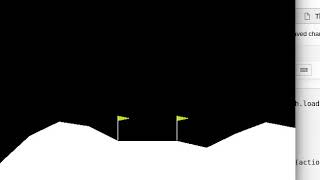

# LunarLander-v2
#### Deep RL based solution of LunarLander-v2 environment. 

## Required installation

1. Install anaconda
2. Run following command to create conda environment and required installation:
- conda create --name py36 python=3.6 anaconda
- conda activate py36
- pip install gym
- pip install box2d box2d-kengz

 for Linux/Windows
- conda install pytorch-cpu torchvision-cpu -c pytorch

 for Mac
- conda install pytorch torchvision -c pytorch

## Run Command

jupyter notebook LunarLander-v2.ipynb
